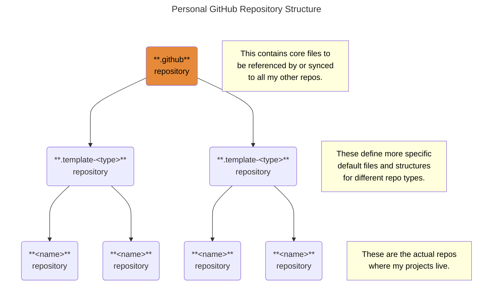

# `.github` Repository <!-- omit from toc -->

This is a special, base template repository that contains
default [community health files][health], [templates][templates],
[workflows][workflows], and any other files
to be shared with derived repositories.
For more information on how this special repository works,
see this article on [freeCodeCamp][freeCodeCamp].

#### Table of Contents <!-- omit from toc -->

- [Description of Files in This Template Repo](#description-of-files-in-this-template-repo)
  - [Community Health Files](#community-health-files)
  - [Other Files](#other-files)

## Description of Files in This Template Repo

### [Community Health Files][health]

| File                         | Exists only in this repo | Synced to (and overridden in) derived repos | Notes      |
| :--------------------------- | :--------------------------: | :-------------------------------------------------: | :--------- |
| [`CODE_OF_CONDUCT.md`][coc]  |              ✅              |                                                     |            |
| [`CONTRIBUTING.md`][contrib] |                              |                         ✅                          |            |
| [`FUNDING.yml`][funding]     |              ✅              |                                                     |            |
| `GOVERNANCE.md`              |                              |                                                     | Not needed |
| [`SECURITY.md`][security]    |                              |                         ✅                          |            |
| [`SUPPORT.md`][support]      |                              |                         ✅                          |            |

### Other Files

| File                            | Exists only in this repo | Synced to (and overridden in) derived repos | Purpose                                     |
| :------------------------------ | :--------------------------: | :-------------------------------------------------: | :------------------------------------------ |
| [`.editorconfig`][editorConfig] |                              |                         ✅                          | [Style guide rule definitions][styleGuides] |
| [`.gitmessage`][message]        |                              |                         ✅                          | [Commit message template][messageGuide]     |
| [`docs/`][docs]                 |                              |                         ✅                          | Contains documentation                      |

<!-- Source Code URIs -->

[coc]: ./CODE_OF_CONDUCT.md
[contrib]: ./CONTRIBUTING.md
[docs]: ./docs/
[editorConfig]: ./.editorconfig
[funding]: ./.github/FUNDING.yml
[message]: ./.gitmessage
[messageGuide]: ./docs/StyleGuides.md#commit-messages
[security]: ./SECURITY.md
[styleGuides]: ./docs/StyleGuides.md
[support]: ./SUPPORT.md

<!-- Public URIs -->

[freeCodeCamp]: https://www.freecodecamp.org/news/how-to-use-the-dot-github-repository
[health]: https://docs.github.com/en/communities/setting-up-your-project-for-healthy-contributions/creating-a-default-community-health-file
[templates]: https://docs.github.com/en/communities/using-templates-to-encourage-useful-issues-and-pull-requests/configuring-issue-templates-for-your-repository
[workflows]: https://docs.github.com/en/actions/how-tos/writing-workflows
