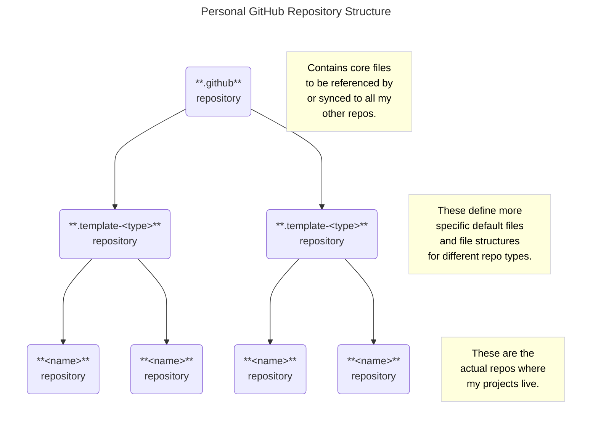

# .github Repository

Contains the default community health files, GitHub templates & workflows,
and any other files that are shared with my other repositories.

Some files exist only in this repo,
and GitHub simply displays them in my other repos.
Other files are replicated to my other repos.
And some of those files are partially overridden in those repos.
For more information on how this special repository works,
see the official [GitHub documentation][health]
or this post on [freeCodeCamp][fcc].
I also make use of upstream Git remotes in each repo,
as well as the [actions-template-sync](sync) GitHub Action
to make this all work.

## New _Template_ Repository Checklist

To create a new _template_ repository
(one level below the `.github` repository):

- [ ] Create a new repository on GitHub:
  - Use the `.github` repository as the template
  - Do NOT include all branches
  - The repository name should use the format: `.template-<type>`
  - Set a description

## Description of Files in This Repo

### Community Health Files

GitHub recognizes the following community health files.
Checked files are stored in this repo.

- [x] `CODE_OF_CONDUCT.md` — Defines standards for how to engage in a community.
  - Exists only in this repo.
  - GitHub automatically links all other repos back to this file.
- [x] `CONTRIBUTING.md` — Communicates how people should contribute to a project.
  - Defined in this repo, synced other other repos.
  - Each repo must override the URIs in the footnotes.
- [x] `FUNDING.yml` — Displays a sponsor button in a repository
      to increase the visibility of funding options for the open-source project.
  - Exists only in this repo.
  - GitHub automatically links all other repos back to this file.
- [ ] `GOVERNANCE.md` — Lets people know about how a project is governed.
      For example, it might discuss project roles and how decisions are made.
  - Not needed for personal projects.
- [x] `LICENSE` — Enables others to freely use, change, and distribute
      the code in an open-source repository.
  - Defined in this repo, synced other other repos.
  - Other repos can override with a different license if needed.
- [x] `SECURITY.md` — Gives instructions on how to report a
      security vulnerability in a project.
  - Defined in this repo, synced other other repos.
  - Each repo must override the URIs in the footnotes.
- [x] `SUPPORT.md` — Lets people know about ways to get help with a project.
  - Defined in this repo, synced other other repos.
  - Each repo must override the URIs in the footnotes.

### GitHub Templates

- [ ] **Discussion category forms** — Templates that are available for
      community members to use when they open new discussions in a repository.
  - Not implemented.
- [x] **Issue templates** and `config.yml` — Define information
      contributors should include when they open issues in a repository.
  - Templates for Bug Reports, Performance Issues, and Feature Requests.
  - Blank issues allowed via `config.yml`.
  - Defined in this repo, synced other other repos.
  - Each repo must override the URIs in the template files.
- [x] **Pull request templates** — Define information contributors should
      include when they open pull requests in a repository.
  - Defined in this repo, synced other other repos.
  - Each repo must override the URIs in the template file.

### GitHub Workflows

- `Template Sync` — Synchronizes changes in a template repo to a child repo.
  - Executes nightly at midnight.
  - Can be manually executed.
  - Defined in this repo, synced other other repos.
  - Each repo must override the template repo to sync with.

### Other Files

- `.github/.templatesyncignore` — Defines which files should not be included
  in the template sync GitHub Action.
  - Defined in this repo, synced (manually) other other repos.
  - Each repo must override the template repo to sync with.
- `docs/` — Contains additional information about various topics
  that applies to all repos.
  - Files only exist in this repo.
  - All other repos can link back to these files.
- `.editorconfig` — Defines coding styles and conventions for a project.
  See the [Editor Config][config] and [Vertical Ruler][rulers] documentation
  for more details.
  - Defined in this repo, synced other other repos.
  - Each repo can add/remove/override settings as needed.
- `.gitmessage` — Contains instructions to help contributors properly format
  a commit message. See the [Conventional Commits][conventional] documentation
  for more details.
  - Defined in this repo, synced other other repos.
  - Install it by running `git config commit.template .gitmessage`

<!-- Source Footnotes -->

[config]: ./docs/EditorConfig.md
[rulers]: ./docs/VerticalRulers.md
[conventional]: ./docs/ConventionalCommits.md

<!-- Public Footnotes -->

[fcc]: https://www.freecodecamp.org/news/how-to-use-the-dot-github-repository
[health]: https://docs.github.com/en/communities/setting-up-your-project-for-healthy-contributions/creating-a-default-community-health-file
[sync]: https://github.com/AndreasAugustin/actions-template-sync
