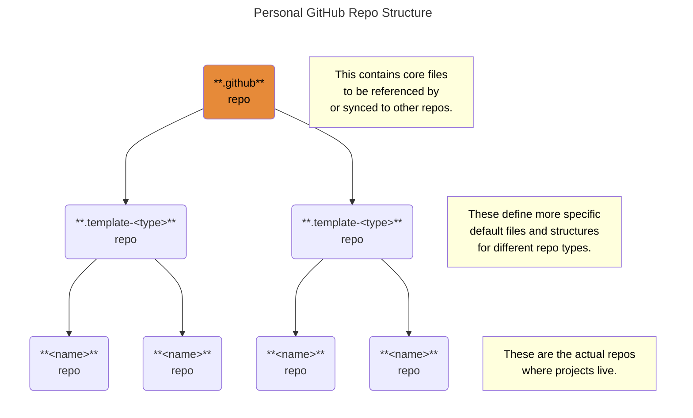

# .github Repository <!-- omit from toc -->

This is a special base template repo that contains
default [community health files][ghComHealth], [templates][ghTemplates],
[workflows][ghWorkflows], and other files
to be shared with derived repositories.
For more information on how this special repo works,
see this article on [freeCodeCamp][freeCodeCamp].

```mermaid
---
title: Personal GitHub Repo Structure
---

flowchart TB

  subgraph subGH [" "]
    gh(**.github**
    repo)

    noteGH[This contains core files
    to be referenced by
    or synced to other repos.]
  end

  subgraph subT [" "]
    T1(**.template-&lt;type&gt;**
    repo)

    T2(**.template-&lt;type&gt;**
    repo)

    noteT[These define more specific
    default files and structures
    for different repo types.]
  end

  subgraph subR [" "]
    R1(**&lt;name&gt;**
    repo)

    R2(**&lt;name&gt;**
    repo)

    R3(**&lt;name&gt;**
    repo)

    R4(**&lt;name&gt;**
    repo)

    noteR[These are the actual repos
    where projects live.]
  end

  classDef current fill:#E68A39,color:#000000
  class gh current

  classDef sub opacity:0
  class subGH,subT,subR sub

  classDef note fill:#FFFFDD,color:#000000
  class noteGH,noteT,noteR note

  gh --> T1
  gh --> T2

  T1 --> R1
  T1 --> R2
  T2 --> R3
  T2 --> R4
```

#### Table of Contents <!-- omit from toc -->

- [Description of Files in This Template Repo](#description-of-files-in-this-template-repo)
  - [Community Health Files](#community-health-files)
  - [GitHub Templates](#github-templates)
  - [Other Files](#other-files)

## Description of Files in This Template Repo

Derived repositories automatically inherit certain files from this template
through GitHub's default file mechanism.
However, files that require repo-specific customization
(such as those containing links to documentation, issues, discussions, etc.,
or those that need to be linked to from other documents)
must be overridden and customized in each derived repository.

### [Community Health Files][ghComHealth]

| File                             | Exists only in .github repo | Overridden in template repo | Notes                    |
| :------------------------------- | :-----------------------------: | :-----------------------------: | :----------------------- |
| 📄[CODE_OF_CONDUCT.md][cocFile]  |                                 |               ✅                | Linked to by other files |
| 📄[CODEOWNERS][codeOwnFile]      |               N/A               |               ✅                |                          |
| 📄[CONTRIBUTING.md][contribFile] |                                 |               ✅                | Links to other files     |
| 📄[FUNDING.yml][fundingFile]     |               ✅                |                                 |                          |
| 📄GOVERNANCE.md                  |                —                |                —                | Not implemented          |
| 📄[LICENSE][licenseFile]         |               N/A               |               ✅                |                          |
| 📄[SECURITY.md][securityFile]    |                                 |               ✅                | Links to GitHub repo     |
| 📄[SUPPORT.md][supportFile]      |                                 |               ✅                | Links to other files     |

### [GitHub Templates][ghTemplates]

| Template                                     | Exists only in .github repo | Overridden in template repo | Notes           |
| :------------------------------------------- | :-----------------------------: | :-----------------------------: | :-------------- |
| 📁Discussion category forms                  |                —                |                —                | Not implemented |
| 📁[Issue templates][issueTemplateFolder]     |                                 |               ✅                | Customizable    |
| 📄[Issue template chooser][issueChooserFile] |               ✅                |                                 |                 |
| 📄[Pull request template][prTemplateFile]    |                                 |               ✅                | Customizable    |

### Other Files

| File                                  | Exists only in .github repo | Overridden in template repo | Description                                               |
| :------------------------------------ | :-----------------------------: | :-----------------------------: | :-------------------------------------------------------- |
| 📁[.vscode/][vsCodeFolder]            |               N/A               |               ✅                | Contains VSCode settings                                  |
| 📁[docs/][docsFolder]                 |               N/A               |               ✅                | Contains documentation                                    |
| 📄[.editorconfig][editorConfigFile]   |               N/A               |               ✅                | Contains [styleguide rule definitions][styleguideFile]    |
| 📄[.gitattributes][gitAttributesFile] |               N/A               |               ✅                | Built using [scaffolding][ghGitAttributes]                |
| 📄[.gitignore][gitIgnoreFile]         |               N/A               |               ✅                | Built using [scaffolding][ghGitIgnore]                    |
| 📄[.gitmessage][gitMessageFile]       |               N/A               |               ✅                | Contains [commit message template][styleguideFile-commit] |

<!-- Source Code URIs (alphabetical by file hierarchy) -->

[issueTemplateFolder]: ./.github/ISSUE_TEMPLATE/
[issueChooserFile]: ./.github/ISSUE_TEMPLATE/config.yml
[codeOwnFile]: ./.github/CODEOWNERS
[fundingFile]: ./.github/FUNDING.yml
[prTemplateFile]: ./.github/pull_request_template.md
[vsCodeFolder]: ./.vscode/
[docsFolder]: ./docs/
[styleguideFile]: ./docs/StyleGuides.md
[styleguideFile-commit]: ./docs/StyleGuides.md#commit-messages
[editorConfigFile]: ./.editorconfig
[gitAttributesFile]: ./.gitattributes
[gitIgnoreFile]: ./.gitignore
[gitMessageFile]: ./.gitmessage
[cocFile]: ./CODE_OF_CONDUCT.md
[contribFile]: ./CONTRIBUTING.md
[licenseFile]: ./LICENSE
[securityFile]: ./SECURITY.md
[supportFile]: ./SUPPORT.md

<!-- GitHub Repo URIs (alphabetical by name) -->

[ghGitAttributes]: https://github.com/gitattributes/gitattributes
[ghGitIgnore]: https://github.com/github/gitignore

<!-- Public URIs (alphabetical by name) -->

[freeCodeCamp]: https://www.freecodecamp.org/news/how-to-use-the-dot-github-repository
[ghComHealth]: https://docs.github.com/en/communities/setting-up-your-project-for-healthy-contributions/creating-a-default-community-health-file
[ghTemplates]: https://docs.github.com/en/communities/using-templates-to-encourage-useful-issues-and-pull-requests/configuring-issue-templates-for-your-repository
[ghWorkflows]: https://docs.github.com/en/actions/how-tos/writing-workflows
