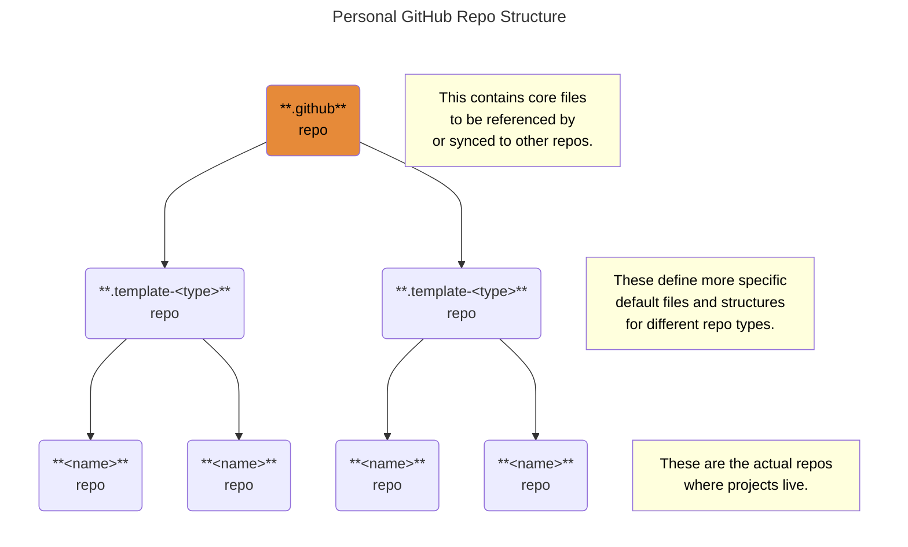

# `.github` Repository <!-- omit from toc -->

This is a special base template repo that contains
default [community health files][health], [templates][templates],
[workflows][workflows], and other files
to be shared with derived repositories.
For more information on how this special repo works,
see this article on [freeCodeCamp][freeCodeCamp].

```mermaid
---
title: Personal GitHub Repo Structure
---

flowchart TB

  subgraph subGH [" "]
    gh(**.github**
    repo)

    noteGH[This contains core files
    to be referenced by
    or synced to other repos.]
  end

  subgraph subT [" "]
    T1(**.template-&lt;type&gt;**
    repo)

    T2(**.template-&lt;type&gt;**
    repo)

    noteT[These define more specific
    default files and structures
    for different repo types.]
  end

  subgraph subR [" "]
    R1(**&lt;name&gt;**
    repo)

    R2(**&lt;name&gt;**
    repo)

    R3(**&lt;name&gt;**
    repo)

    R4(**&lt;name&gt;**
    repo)

    noteR[These are the actual repos
    where projects live.]
  end

  classDef current fill:#E68A39,color:#000000
  class gh current

  classDef sub opacity:0
  class subGH,subT,subR sub

  classDef note fill:#FFFFDD,color:#000000
  class noteGH,noteT,noteR note

  gh --> T1
  gh --> T2

  T1 --> R1
  T1 --> R2
  T2 --> R3
  T2 --> R4
```

#### Table of Contents <!-- omit from toc -->

- [Description of Files in This Template Repo](#description-of-files-in-this-template-repo)
  - [Community Health Files](#community-health-files)
  - [GitHub Templates](#github-templates)
  - [Other Files](#other-files)

## Description of Files in This Template Repo

While GitHub automatically inherits some files from this `.github` repo,
others must be copied to derived repos to allow customization.
Files that contain repo-specific links (to documentation, issues, discussions, etc.)
need to be overridden in each derived repo so the URLs point to the correct location.

### [Community Health Files][health]

| File                           | Exists only in this repo | Overridden in derived repos | Notes           |
| :----------------------------- | :--------------------------: | :-----------------------------: | :-------------- |
| 📄[`CODE_OF_CONDUCT.md`][coc]  |              ✅              |                                 |                 |
| 📄[`CODEOWNERS`][codeOwners]   |             N/A              |               ✅                |                 |
| 📄[`CONTRIBUTING.md`][contrib] |                              |               ✅                |                 |
| 📄[`FUNDING.yml`][funding]     |              ✅              |                                 |                 |
| 📄`GOVERNANCE.md`              |              —               |                —                | Not implemented |
| 📄[`LICENSE`][license]         |             N/A              |               ✅                |                 |
| 📄[`SECURITY.md`][security]    |                              |               ✅                |                 |
| 📄[`SUPPORT.md`][support]      |                              |               ✅                |                 |

### [GitHub Templates][templates]

| Template                            | Exists only in this repo | Overridden in derived repos | Notes           |
| :---------------------------------- | :--------------------------: | :-----------------------------: | :-------------- |
| 📁Discussion category forms         |              —               |                —                | Not implemented |
| 📁[Issue templates][issues]         |                              |               ✅                |                 |
| 📄[Issue template chooser][chooser] |              ✅              |                                 |                 |
| 📄[Pull request template][prs]      |                              |               ✅                |                 |

### Other Files

| File                              | Exists only in this repo | Overridden in derived repos | Purpose                                     |
| :-------------------------------- | :--------------------------: | :-----------------------------: | :------------------------------------------ |
| 📁[`.vscode/`][vsCode]            |             N/A              |               ✅                | Contains VSCode settings                    |
| 📁[`docs/`][docs]                 |             N/A              |               ✅                | Contains documentation                      |
| 📄[`.editorconfig`][editorConfig] |             N/A              |               ✅                | [Style guide rule definitions][styleGuides] |
| 📄[`.gitmessage`][message]        |             N/A              |               ✅                | [Commit message template][messageGuide]     |

<!-- Source Code URIs -->

[chooser]: ./.github/ISSUE_TEMPLATE/config.yml
[coc]: ./CODE_OF_CONDUCT.md
[codeOwners]: ./.github/CODEOWNERS
[contrib]: ./CONTRIBUTING.md
[docs]: ./docs/
[editorConfig]: ./.editorconfig
[funding]: ./.github/FUNDING.yml
[issues]: ./.github/ISSUE_TEMPLATE/
[license]: ./LICENSE
[message]: ./.gitmessage
[messageGuide]: ./docs/StyleGuides.md#commit-messages
[prs]: ./.github/pull_request_template.md
[security]: ./SECURITY.md
[styleGuides]: ./docs/StyleGuides.md
[support]: ./SUPPORT.md
[vsCode]: ./.vscode/

<!-- Public URIs -->

[freeCodeCamp]: https://www.freecodecamp.org/news/how-to-use-the-dot-github-repository
[health]: https://docs.github.com/en/communities/setting-up-your-project-for-healthy-contributions/creating-a-default-community-health-file
[templates]: https://docs.github.com/en/communities/using-templates-to-encourage-useful-issues-and-pull-requests/configuring-issue-templates-for-your-repository
[workflows]: https://docs.github.com/en/actions/how-tos/writing-workflows
