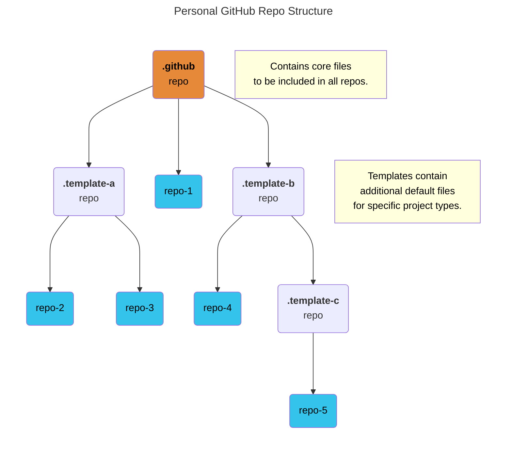

# .github Repository <!-- omit from toc -->

This is a special base template repo that contains
default [community health files][ghComHealth], [templates][ghTemplates],
[workflows][ghWorkflows], and other files
to be shared with derived repositories.
For more information on how this special repo works,
see this article on [freeCodeCamp][freeCodeCamp].

```mermaid
---
title: Personal GitHub Repo Structure
---

flowchart TB

  subgraph row1 [" "]
    github(<b>.github</b>
    repo)

    githubNote[Contains core files
    to be included in all repos.]
  end

  subgraph row2 [" "]
    templateA(<b>.template-a</b>
    repo)

    repo1(repo-1)

    templateB(<b>.template-b</b>
    repo)

    templateNote[Templates contain
    additional default files
    for specific project types.]
  end

  subgraph row3 [" "]
    repo2(repo-2)
    repo3(repo-3)
    repo4(repo-4)

    templateC(<b>.template-c</b>
    repo)
  end

  subgraph row4 [" "]
    repo5(repo-5)
  end

  classDef row opacity:0
  class row1,row2,row3,row4 row

  classDef current fill:#E68A39,color:#000000
  class github current

  classDef note fill:#FFFFDD,color:#000000
  class githubNote,templateNote note

  classDef repo fill:#34C3EB,color:#000000
  class repo1,repo2,repo3,repo4,repo5 repo

  github --> templateA
  github --> repo1
  github --> templateB

  templateA --> repo2
  templateA --> repo3
  templateB --> repo4
  templateB --> templateC

  templateC --> repo5
```

For how a change travels between these repos, and who owns which file when
a sync conflicts, see [Template Chain][chainFile].

#### Table of Contents <!-- omit from toc -->

- [Description of Files in This Template Repo](#description-of-files-in-this-template-repo)
  - [Community Health](#community-health)
  - [GitHub Configuration](#github-configuration)
  - [GitHub Workflows](#github-workflows)
  - [Other Files](#other-files)

## Description of Files in This Template Repo

GitHub allows some community health and GitHub configuration files
to only reside in the .github repo
and automatically appear in all other repos.
However, we can't take full advantage of that feature
because most files need repo-specific customization.

In the tables below, **Exists only in .github repo** marks a file scaffolding
deletes when it creates a derived repo. In **Overridden in template repo**:
**✅** marks a file scaffolding actively rewrites or retargets for the new
repo (`settings.yml`, always; `LICENSE`, only when private; `CONTRIBUTING.md`,
`SECURITY.md`, `SUPPORT.md` and the issue forms, whose owner/repo links get
retargeted); **➕** marks a file each layer extends without disturbing what
came before — a new block, a new key, or a whole new file; a blank cell means
the file is inherited unchanged, free to customize by hand if you want to.

### [Community Health][ghComHealth]

| File                                | Exists only in .github repo | Overridden in template repo | Notes                    |
| :---------------------------------- | :-----------------------------: | :-----------------------------: | :----------------------- |
| 📁[.github/][githubFolder]           |                                 |                                 |                          |
| &nbsp;├─📄[CODEOWNERS][codeOwnFile]  |               N/A               |                                 |                          |
| &nbsp;└─📄[FUNDING.yml][fundingFile] |                ✅                |                                 |                          |
| 📄[CODE_OF_CONDUCT.md][cocFile]      |                                 |                                 | Linked to by other files |
| 📄[CONTRIBUTING.md][contribFile]     |                                 |                ✅                | Links to other files     |
| 📄GOVERNANCE.md                      |                —                |                —                | Not implemented          |
| 📄[LICENSE][licenseFile]             |               N/A               |            ✅ (private)          |                          |
| 📄[SECURITY.md][securityFile]        |                                 |                ✅                | Links to GitHub repo     |
| 📄[SUPPORT.md][supportFile]          |                                 |                ✅                | Links to other files     |

### GitHub Configuration

| Template                                                         | Exists only in .github repo | Overridden in template repo | Description                                     |
| :--------------------------------------------------------------- | :-----------------------------: | :-----------------------------: | :---------------------------------------------- |
| 📁[.github/][githubFolder]                                        |                                 |                                 |                                                 |
| &nbsp;├─📁DISCUSSION_TEMPLATE/                                    |                —                |                —                | Not implemented                                 |
| &nbsp;├─📁[instructions/][instructionsFolder]                     |               N/A               |                ➕                | [Path-scoped AI instructions][aiFile]           |
| &nbsp;├─📁[ISSUE_TEMPLATE/][issueFormsFolder]                     |                                 |                ✅                | Contains [GitHub Issue forms][ghIssueForms]     |
| &nbsp;│&nbsp;&nbsp;&nbsp;&nbsp;└─📄[config.yml][issueChooserFile] |                ✅                |                                 | [GitHub Issue template chooser][ghIssueChooser] |
| &nbsp;├─📄[codecov.yml][codecovFile]                              |               N/A               |                ➕                | [Coverage thresholds][codecovDocs]              |
| &nbsp;├─📄[copilot-instructions.md][copilotFile]                  |               N/A               |                ✅                | [Copilot configuration][ghCopilot]              |
| &nbsp;├─📄[dependabot.yml][dependabotFile]                        |               N/A               |                ➕                | [Dependabot configuration][ghDependabot]        |
| &nbsp;├─📄[pull_request_template.md][prTemplateFile]              |                                 |                                 | [GitHub Pull Request template][ghPRTemplate]    |
| &nbsp;└─📄[settings.yml][settingsFile]                            |               N/A               |                ✅                | [Repo configuration][ghSettings]                |

Shared composite actions and reusable workflows live in the separate
[TaffarelJr/.actions][actionsRepo] repo, not under `.github/` here — every
workflow below is a thin trigger that calls one.

### [GitHub Workflows][ghWorkflows]

| Workflow                                                                           | Description                                                                              |
| :---------------------------------------------------------------------------------- | :---------------------------------------------------------------------------------------- |
| 📁[.github/][githubFolder]                                                         |                                                                                           |
| &nbsp;└─📁[workflows/][workflowFolder]                                             |                                                                                           |
| &nbsp;&nbsp;&nbsp;&nbsp;&nbsp;&nbsp;&nbsp;├─📄[Continuous Integration][ciWorkflow] | Runs the [scaffolding scripts'][scriptsFile] tests on both platforms                     |
| &nbsp;&nbsp;&nbsp;&nbsp;&nbsp;&nbsp;&nbsp;├─📄[Create Release][createWorkflow]     | Entry point for [cutting a release][releaseFile], via [TaffarelJr/.actions][actionsRepo] |
| &nbsp;&nbsp;&nbsp;&nbsp;&nbsp;&nbsp;&nbsp;├─📄[Template Sync][syncWorkflow]        | Brings changes from a template repo, via [TaffarelJr/.actions][actionsRepo]              |
| &nbsp;&nbsp;&nbsp;&nbsp;&nbsp;&nbsp;&nbsp;└─📄[Validate Codecov][codecovWorkflow]  | Checks `codecov.yml` against Codecov's validator, via [TaffarelJr/.actions][actionsRepo] |

### Other Files

| File                                 | Description                                              |
| :----------------------------------- | :------------------------------------------------------- |
| 📁[.claude/][claudeFolder]            | [AI agents and skills][aiFile]                           |
| &nbsp;└─📄[CLAUDE.md][claudeFile]     | Imports [AGENTS.md][agentsFile] for Claude Code          |
| 📁[.github/agents/][ghAgentsFolder]   | Copilot mirrors of [those agents][aiFile]                |
| 📁[.vscode/][vsCodeFolder]            | Contains VSCode settings                                 |
| 📁[docs/][docsFolder]                 | Contains documentation                                   |
| 📁[scripts/][scriptsFolder]           | [Repo scaffolding scripts][scriptsFile], and their tests |
| 📄[.editorconfig][editorConfigFile]   | [Styleguide rule definitions][styleguideFile]            |
| 📄[.gitattributes][gitAttributesFile] | Built using [scaffolding][ghGitAttributes]               |
| 📄[.gitignore][gitIgnoreFile]         | Built using [scaffolding][ghGitIgnore]                   |
| 📄[.gitmessage][gitMessageFile]       | [Commit message template][styleguideFile-commit]         |
| 📄[AGENTS.md][agentsFile]             | [AI agent instructions][aiFile]                          |
| 📄[GitVersion.yml][gitVersionFile]    | [How the version is calculated][releaseFile]             |

<!-- Source Code URIs (folders first, then files; each alphabetical) -->

[claudeFolder]: ./.claude/
[claudeFile]: ./.claude/CLAUDE.md
[githubFolder]: ./.github/
[ghAgentsFolder]: ./.github/agents/
[instructionsFolder]: ./.github/instructions/
[issueFormsFolder]: ./.github/ISSUE_TEMPLATE/
[issueChooserFile]: ./.github/ISSUE_TEMPLATE/config.yml
[workflowFolder]: ./.github/workflows/
[ciWorkflow]: ./.github/workflows/continuous-integration.yml
[createWorkflow]: ./.github/workflows/create-release.yml
[syncWorkflow]: ./.github/workflows/template-sync.yml
[codecovWorkflow]: ./.github/workflows/validate-codecov.yml
[codeOwnFile]: ./.github/CODEOWNERS
[codecovFile]: ./.github/codecov.yml
[copilotFile]: ./.github/copilot-instructions.md
[dependabotFile]: ./.github/dependabot.yml
[fundingFile]: ./.github/FUNDING.yml
[prTemplateFile]: ./.github/pull_request_template.md
[settingsFile]: ./.github/settings.yml
[vsCodeFolder]: ./.vscode/
[docsFolder]: ./docs/
[aiFile]: ./docs/AiInstructions.md
[chainFile]: ./docs/TemplateChain.md
[releaseFile]: ./docs/ReleaseProcess.md
[styleguideFile]: ./docs/Styleguide.md
[styleguideFile-commit]: ./docs/Styleguide.md#commit-messages
[scriptsFolder]: ./scripts/
[scriptsFile]: ./scripts/README.md

[editorConfigFile]: ./.editorconfig
[gitAttributesFile]: ./.gitattributes
[gitIgnoreFile]: ./.gitignore
[gitMessageFile]: ./.gitmessage
[agentsFile]: ./AGENTS.md
[cocFile]: ./CODE_OF_CONDUCT.md
[contribFile]: ./CONTRIBUTING.md
[gitVersionFile]: ./GitVersion.yml
[licenseFile]: ./LICENSE
[securityFile]: ./SECURITY.md
[supportFile]: ./SUPPORT.md

<!-- GitHub Repo URIs (alphabetical) -->

[actionsRepo]: https://github.com/TaffarelJr/.actions
[ghGitAttributes]: https://github.com/gitattributes/gitattributes
[ghGitIgnore]: https://github.com/github/gitignore
[ghSettings]: https://github.com/repository-settings/app

<!-- Public URIs (alphabetical) -->

[codecovDocs]: https://docs.codecov.com/docs/codecovyml-reference
[freeCodeCamp]: https://www.freecodecamp.org/news/how-to-use-the-dot-github-repository
[ghComHealth]: https://docs.github.com/en/communities/setting-up-your-project-for-healthy-contributions/creating-a-default-community-health-file
[ghCopilot]: https://docs.github.com/en/copilot/customizing-copilot/adding-repository-custom-instructions-for-github-copilot
[ghDependabot]: https://docs.github.com/en/code-security/dependabot/working-with-dependabot/dependabot-options-reference
[ghIssueChooser]: https://docs.github.com/en/communities/using-templates-to-encourage-useful-issues-and-pull-requests/configuring-issue-templates-for-your-repository#configuring-the-template-chooser
[ghIssueForms]: https://docs.github.com/en/communities/using-templates-to-encourage-useful-issues-and-pull-requests/syntax-for-issue-forms
[ghPRTemplate]: https://docs.github.com/en/communities/using-templates-to-encourage-useful-issues-and-pull-requests/creating-a-pull-request-template-for-your-repository
[ghTemplates]: https://docs.github.com/en/communities/using-templates-to-encourage-useful-issues-and-pull-requests/configuring-issue-templates-for-your-repository
[ghWorkflows]: https://docs.github.com/en/actions/how-tos/writing-workflows
