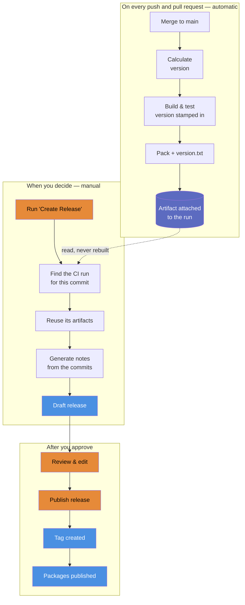

# Release Process <!-- omit from toc -->

This document describes how a version number is decided,
how binaries are built, and how a release is cut and published.

#### Table of Contents <!-- omit from toc -->

- [Principles](#principles)
- [The Shape of It](#the-shape-of-it)
- [Version Numbers](#version-numbers)
  - [What Bumps What](#what-bumps-what)
  - [Forcing a Version](#forcing-a-version)
- [Cutting a Release](#cutting-a-release)
  - [1. Draft](#1-draft)
  - [2. Review](#2-review)
  - [3. Publish](#3-publish)
- [Release Notes vs. Changelog](#release-notes-vs-changelog)
  - [Writing the Summary](#writing-the-summary)
    - [Getting the token](#getting-the-token)
- [What Each Layer Owns](#what-each-layer-owns)

## Principles

**Build once.**
Binaries are built, versioned, tested, and uploaded by CI on every run.
A release does not rebuild anything —
it finds the CI run for that exact commit and ships *those* artifacts.
So what reaches a consumer is bit-for-bit what the tests passed against,
and a release can never differ from the build that verified it.

**A release is a decision, not a side effect.**
Every merge to `main` is built and verified,
but that is a different question from "these changes are worth a version number".
Nothing is released until someone says so.

**Nothing is drafted that cannot be thrown away.**
The release is created as a draft:
no tag, nothing published, no downstream workflow fired.
Deleting a draft leaves no trace, so getting it wrong costs nothing.

**One tool decides the version, everywhere.**
[GitVersion][gitVersion] reads git history and `GitVersion.yml` only.
It does not know or care what the repo is written in,
so the same configuration governs .NET, Node, and whatever comes next.

## The Shape of It



## Version Numbers

Versions follow [Semantic Versioning][semver]
and are calculated from the [Conventional Commits][conventions] in the history.
Nobody edits a version in a file, so nobody can forget to.

### What Bumps What

GitVersion applies the **highest** bump found since the last release tag —
not one bump per commit.
Ten `feat:` commits are still a single minor release.

| In the commit                  | Bump      | Example                      |
| ------------------------------ | --------- | ---------------------------- |
| `!` before the colon           | **major** | `feat(api)!: rename Run`     |
| `BREAKING CHANGE:` in the body | **major** | in the body, not the subject |
| `+semver: major` in the body   | **major** | escape hatch                 |
| `feat:`                        | **minor** | `feat: add a --json flag`    |
| `+semver: minor` in the body   | **minor** | escape hatch                 |
| any other type                 | **patch** | `fix:`, `docs:`, `chore:`    |
| `+semver: none` in the body    | patch     | cancels an escalation        |
| a merge commit                 | none      | merges restate their parts   |

Anything that is not a Conventional Commit contributes no escalation,
but `main` carries a default patch increment,
so every commit past a tag still gets its own version.
Two commits sharing a version would make an artifact ambiguous.

### Forcing a Version

Two ways, for two different situations.

**A one-off bump the commit type does not imply** —
use the escape hatch in the commit body.
It is recorded in the history rather than in a file
someone has to remember to change back:

```
chore: restructure the public surface

+semver: major
```

**A specific next release** —
raise `next-version` in [`GitVersion.yml`][gitVersionFile]:

```yaml
next-version: 2.0.0
```

This is the manual release lever.
Set it, let CI build, then run `Create Release`.
Once the release is published the tag catches up
and `next-version` goes inert on its own,
so there is nothing to remember to undo.

`next-version` is a **pin, not a floor**.
While it sits above every existing tag it *is* the answer,
and the commit-message increments are ignored —
so a repo full of `feat:` commits still reports that exact number.
The moment a tag reaches it, it goes inert
and normal incrementing resumes on its own.

That makes it right for two jobs only:
seeding a repo that has no tags yet (this is why it starts at `0.0.1`),
and declaring a specific next release.
It is the wrong tool for a routine bump —
raise it and forget, and every commit in between reports the same version.

## Cutting a Release

### 1. Draft

`Actions` → `Create Release` → `Run workflow` → `main`.

There is exactly one way in, on purpose.
Pushing a tag looks like it ought to work too,
but the version is stamped into the binaries **when CI builds them** —
so a tag could only ever name the version that was already built,
and if it named a different one the release would have to either lie or rebuild.
To choose a version, [set `next-version`](#forcing-a-version)
and let CI build it.

This produces a draft release
with the notes generated and the CI artifacts attached.
Re-running **replaces** the existing draft for that version
rather than adding a second one,
so there is never a pile of abandoned drafts to clean up.

If the version has already been tagged — meaning it has already been
published — the workflow refuses,
rather than quietly replacing something a consumer has already resolved.

### 2. Review

Open the draft under `Releases`, and check:

- ✅ The version is what you expected
- ✅ The artifacts are attached
- ✅ The notes read correctly

If it is wrong, delete the draft. Nothing else happened.

### 3. Publish

Press `Publish release`.

**This is the deployment.**
Everything before it is reversible;
this is the step that makes the version public.
It creates the tag — which is what the *next* version is calculated from —
and fires the publish workflow for that repo.

## Release Notes vs. Changelog

These are two different documents for two different readers,
and conflating them is why release pages end up unreadable.

|          | Release notes                      | Changelog                       |
| -------- | ---------------------------------- | ------------------------------- |
| Answers  | "Should I upgrade?"                | "When did this change?"         |
| Audience | someone deciding                   | someone investigating           |
| Length   | a few lines                        | every commit                    |
| Voice    | prose, curated                     | mechanical, complete            |
| Where    | top of the release, always visible | folded into a `<details>` below |

[`New-Changelog.ps1`][changelogScript] emits both, in one body:

1. **The summary** — what changed and why it matters.
2. **The counts** — the size and shape of the release at a glance.
3. **Breaking Changes** — aggregated to the top,
   with the author's own explanation from the commit body.
   The one thing a reader must not miss, so it is never folded away.
4. **The changelog** — everything else grouped by type,
   ordered by how much a reader cares, behind a `<details>` fold.
5. **A compare link** — the commit-by-commit detail,
   available without being inlined.

Every commit appears somewhere.
A non-conventional commit lands under **Other Changes**
rather than being dropped —
untidy notes beat notes that quietly hide a change.

There is no committed `CHANGELOG.md`.
The releases *are* the changelog:
a file in the repo would need a commit to update,
which changes the history it is trying to describe.

### Writing the Summary

The workflow always asks a model to draft the opening paragraph
from the generated changelog, using the `COPILOT_PAT` secret.

It is never required. A missing or expired token, a service outage,
a network error — all land in the same place:
the summary stays a placeholder and the release is still drafted.
A missing paragraph is not worth failing a release over.

The placeholder is an HTML comment, so a draft published without one
simply has no opening paragraph, rather than a visible `TODO`.
Replace the whole comment with a paragraph or two to fill it in,
or delete the draft and re-run once the service is back.

#### Getting the token

The summary runs through the [`actions/ai-inference`][aiAction] action,
which drives the Copilot CLI.
That authenticates an *account* holding a Copilot entitlement,
so it needs a personal access token — the built-in `GITHUB_TOKEN` will not do.

1. `Settings` → `Developer settings` → `Personal access tokens`
2. Generate a **fine-grained** token with no repository access,
   because it authenticates the account rather than a repo
3. [Add it as the `COPILOT_PAT` secret][actionsSecrets]

A personal account cannot share an Actions secret across repos —
that is an organization feature — so the secret is per-repo.
`New-Repo.ps1` sets it when creating a repo,
reading the value from the `COPILOT_PAT` environment variable
so there is nothing to paste in.

## What Each Layer Owns

**Nothing here is layer-specific.**

Building once has a pleasant side effect:
because the release workflow no longer builds anything,
it needs no toolchain.
So the whole apparatus —
the version calculation, the changelog generation,
the release workflows, and the scripts they call —
lives in the base repo and is inherited unchanged by every layer below.

A layer contributes exactly one thing:
the packing step in its own CI workflow,
which produces the artifact a release later attaches.
Everything above that works without modification.

<!-- Source Code URIs (folders first, then files; each alphabetical) -->

[conventions]: ./ConventionalCommits.md
[changelogScript]: ../scripts/New-Changelog.ps1
[gitVersionFile]: ../GitVersion.yml

<!-- GitHub URIs (alphabetical by name) -->

[actionsSecrets]: https://docs.github.com/en/actions/security-for-github-actions/security-guides/using-secrets-in-github-actions
[aiAction]: https://github.com/actions/ai-inference

<!-- Public URIs (alphabetical by name) -->

[gitVersion]: https://gitversion.net/docs
[semver]: https://semver.org
